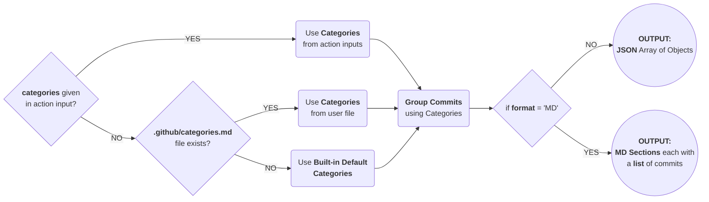

# Action Generate Changelog

> Generate `Release Changelog` from Commit Subjects.



## Features

## Inputs

### `commits` (str)

### `format` (str)

### `categories` (str)

## Outputs

### `content` (str)

## Example

```yaml
```
