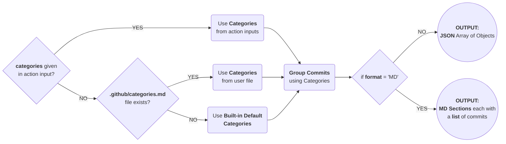

# Action Generate Changelog

> Generate `Release Changelog` from Commit Subjects.

[](https://github.com/boromir674/action-generate-changelog/actions/workflows/cicd.yml)


[](https://github.com/boromir674/action-generate-changelog/blob/main/LICENSE)
[](https://github.com/boromir674/action-generate-changelog/compare/v0.1.0..main)




## Features

## Inputs

### `commits` (str)
> Commit Subjects as JSON array of strings.

Example **value**:
```json
[
    "feat: add feature X2",
    "test: add Test Case for feature X2",
    "fix: fix feature X1",
    "feat: add feature X1"
]
```

### `format` (str)
> The format, 'MD' (for Markdown) or 'JSON', to use for the Action Output

Example **value**: `MD` or `JSON`

### `categories` (str)
> Comma-separated Categories to use for grouping the Commits.

Example **value**:
```
feat,fix,refactor,test,build,docs,ci,style,chore
```
## Outputs

### `content` (str)
> Either **Markdown** Sections, each with a list, or **JSON** array of Objects

#### Example **Markdown value**
```markdown
## feat
- add feature `X2`
- add feature `X1`

## fix
- handle corner case for input X in function Y

## test
- test feature X returns expected data

## docs
- add Documentation Sources for `mkdocs` build

## ci
- add CI/CD Pipeline

```

#### Example **JSON value**
```json
[
  {
    "category": "feat",
    "commits": [
      "add feature X2",
      "add feature X1"
    ]
  },
  {
    "category": "fix",
    "commits": [
      "handle corner case for input X in function Y"
    ]
  },
  {
    "category": "test",
    "commits": [
      "test feature X returns expected data"
    ]
  },
  {
    "category": "ci",
    "commits": [
      "add CI/CD Pipeline"
    ]
  }
]
```

## Examples

> Retrieve Value with `${{ steps.groups.commits.output.content }}`, in your next Job steps.

## With static input
```yaml
jobs:
  my_jobs:
  runs-on: ubuntu-latest
  steps:
    - name: Group Commits under Markdown Sections
      id: group_commits
      uses: boromir674/action-generate-changelog@v1.0.0
      with:
          commits: |
            '[
                "feat: add feature X2",
                "test: test feature X2 returns expected data",
                "fix: handle corner case for X1 function input",
                "feat: add feature X1",
                "ci: add CI/CD Pipeline"
            ]'
          output_format: 'MD'
          categories: 'feat,fix,refactor,test,build,docs,ci,style,chore'
```
Returns `Markdown Content` as **multi-line Unicode** string

```markdown
## feat
- add feature X2
- add feature X1

## fix
- handle corner case for X1 function inpu

## test
- test feature X2 returns expected data

## ci
- add CI/CD Pipeline

```
